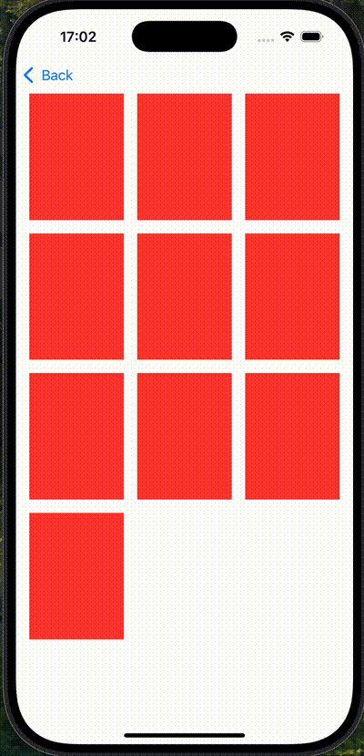
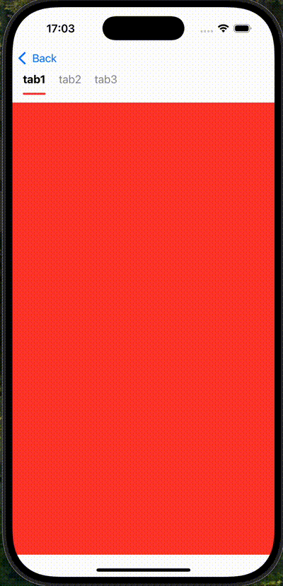

# SWSwiftUIKit

[](https://travis-ci.org/121805186@qq.com/SWSwiftUIKit)
[](https://cocoapods.org/pods/SWSwiftUIKit)
[](https://cocoapods.org/pods/SWSwiftUIKit)
[](https://cocoapods.org/pods/SWSwiftUIKit)

## Example

To run the example project, clone the repo, and run `pod install` from the Example directory first.

## 🎥 使用效果演示






## Installation

SWSwiftUIKit is available through [CocoaPods](https://cocoapods.org). To install
it, simply add the following line to your Podfile:

```ruby
pod 'SWSwiftUIKit'
```

## Author

Steven Wu, 121805186@qq.com

## License

SWSwiftUIKit is available under the MIT license. See the LICENSE file for more info.
